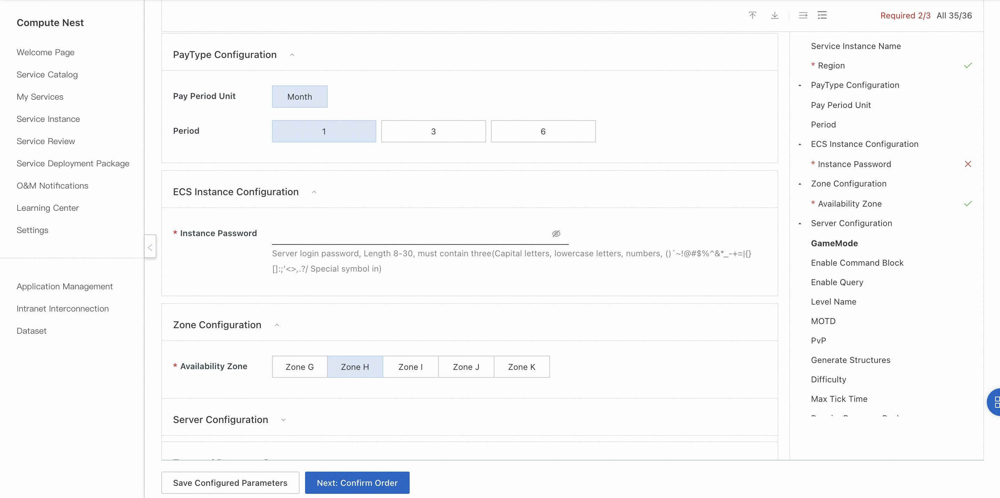
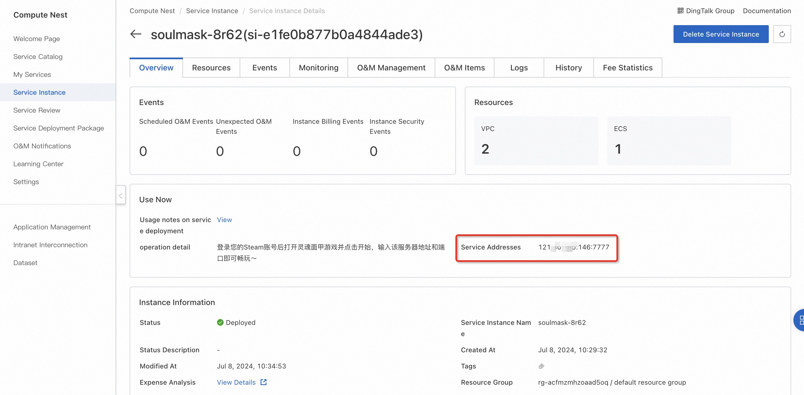
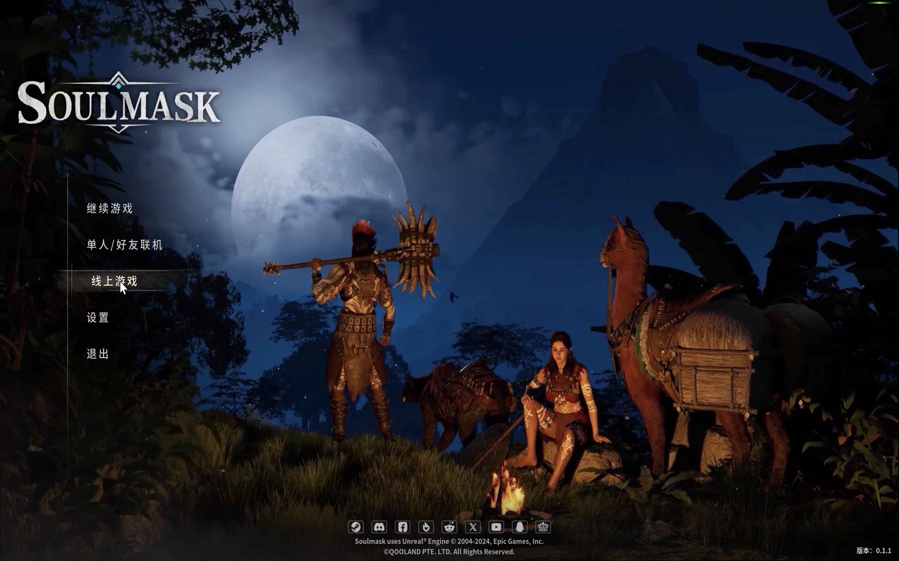
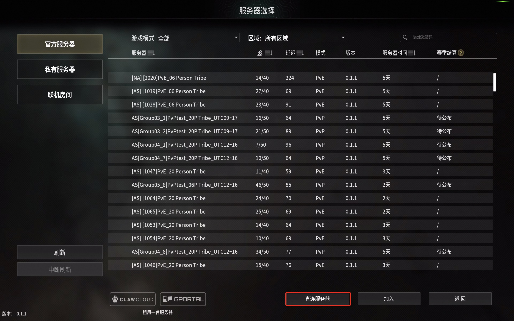

<h1>3-minute deployment of Soul Face A online service </h1>

<h2> Overview </h2>

 Soul Face Armor (Soulmask) is developed by CampFire Studio, Qooland
Games released an open world survival production game, is a main real-life experience of survival sandbox game. As the "last man" of the tribe with the blessing of the mysterious face armor, players will struggle to survive and open up their own way to rise in a primitive continent full of mysterious worship. Explore, build and recruit clansmen from scratch to strengthen their clans and tribes, and finally explore and reveal the mysterious truth of civilization behind this world. 

<h2> Billing instructions </h2>

 the cost of soul face a online service on the computing nest mainly involves: selected vCPU and memory specifications, disk capacity, public network bandwidth
Billing methods include: annual package, monthly package, pay-as-you-go (hours)
The estimated cost can be seen in real time when the instance is created. 

<h2> Create an ECS </h2>

<h3> Step 1: Select Configuration </h3>

<ol>
<li> Service instance name (if there is no special requirement, keep the default);</li>
<li> Select the deployment region (you can select the city closest to you. If there are no special requirements, keep the default value);</li>
<li>
 Select configuration:

<table>
<thead>
<tr>
<th> Package name </th>
<th> Description </th>
</tr>
</thead>
<tbody>
<tr>
<td> Supports up to 10 players </td>
<td>4-core 16G,10M bandwidth unlimited traffic </td>
</tr>
<tr>
<td> Supports up to 20 players </td>
<td>8-core 32G,10M bandwidth unlimited traffic </td>
</tr>
<tr>
<td> Custom Package </td>
<td> ECS configuration can be freely selected, suitable for advanced DIY players </td>
</tr>
</tbody>
</table>

<li>
 configure the server password and available area (if there is no special requirement, keep the default). after the configuration is completed, click next to confirm the order.

</li>
</ol>

<h3> Step 2: Create a service </h3>

<ol>
<li> on the service confirmation page, check agree to the terms of service, click "create now", followed by the payment process. </li>
<li> when the prompt of successful submission appears, the service has been created. click "go to the list to view" to see that the service is being deployed.
</ol>

<h3> Step 3: Enter the instance details </h3>

<ol>
<li> the service can be created in less than 1 minute. when the service status changes to "deployed", click the service instance ID to enter the service details.<li> by the time of this step, the server installation program of soul face a has been preset in the mirror image of the service, which is very convenient without manual copy. </li>
<li> see "soul face a server address port", this is the IP address of the server you built, copy this address for the next operation.
</li>
</ol>

<h2> Login to the game </h2>

 precondition: soul face armor has been purchased and installed on steam platform. 

<ol>
<li>
 Log in to your Steam account and start the game.
<li>
 Click on the online game after entering the game.

</li>
<li>
 Directly connected to the server.

</li>
<li>
 Paste the server address port generated above and connect.
<li>
 wait for the game to load and play.

</li>
</ol>
