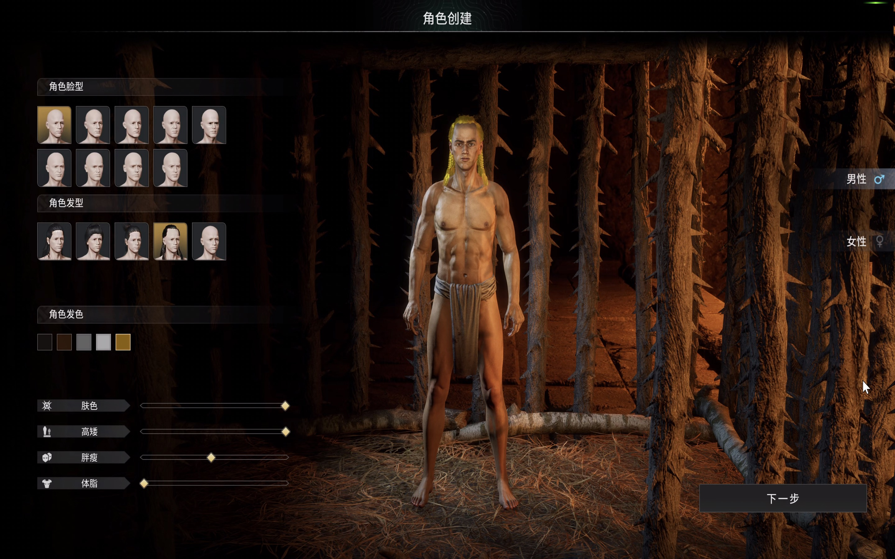

# 3分钟部署灵魂面甲联机服务

## 概述

灵魂面甲（Soulmask）是由CampFire Studio开发，Qooland
Games发行的一款开放世界生存制作类游戏，是一款主打真实体验的生存沙盒游戏。作为拥有神秘面甲加持的部落“最后一人”，玩家将在一片充满神秘崇拜的原始大陆艰难求生并开辟自己的崛起之路。从零开始探索、建造，招募族人壮大自己的氏族部落，最终探寻和揭示蕴藏在这个世界背后文明的神秘真相。

## 计费说明

灵魂面甲联机服务在计算巢上的费用主要涉及：所选vCPU与内存规格、磁盘容量、公网带宽
计费方式包括：包年包月、按量付费（小时）
预估费用在创建实例时可实时看到。

## 创建云服务器

### 第一步：选择配置

1. 服务实例名称（如无特殊要求，保持默认即可）；
2. 选择部署地域（可以选择离自己最近的城市，如无特殊要求，保持默认即可）；
3. 选择配置:

   | 套餐名 | 说明 |
      |-----------|------------------------------------|
   | 最多支持10个玩家 | 4核16G，10M带宽不限流量 |
   | 最多支持20个玩家 | 8核32G，10M带宽不限流量 |
   | 自定义套餐 | 可自由选择ECS配置，适合高阶DIY玩家 |
   

4. 配置服务器密码和 可用区（如无特殊要求，保持默认即可），配置完成之后，点击下一步，确认订单。
   

### 第二步：创建服务

1. 在服务确认页面，勾选同意服务条款，点击“立即创建”，后面就是付款流程。
2. 当出现提交成功提示，说明服务已经开始创建，点击“去列表查看”，可以看到服务正在部署中。
   

### 第三步：进入实例详情

1. 服务不到1分钟即可完成创建，当服务的状态变成“已部署”，点击服务实例ID进入服务详情。
   
2. 到这一步的时候，灵魂面甲的服务端安装程序已经预置在服务的镜像里了，无需手动复制，非常方便。
3. 看到“灵魂面甲服务器地址端口”，这就是你搭建服务器的IP地址了，复制这个地址用于下一步操作。
   

## 登录游戏

前置条件：已经在steam平台购买并安装灵魂面甲。

1. 登录您的steam账号并开始游戏。
   

2. 进入游戏后点击线上游戏。
   

3. 直连服务器。
   

4. 粘贴上文生成的服务器地址端口并连接。
   

5. 等待游戏加载完成即可畅玩啦。
   
